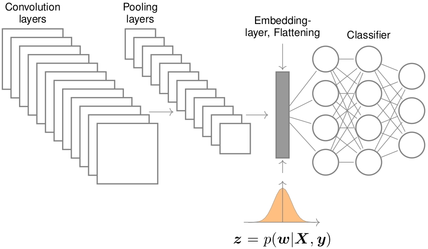

# DTW analysis in the embedding layer of the CNN model
Henry D. Chacon, henrychacon@gmail.com

## Abstract

The convolution neural network models mimic the image detection process followed by mammals. Where each image is decomposed in a specific signature or signal. In this report, the popular LeNet-5 model is trained with the NMIST data set to measure the signal separation in the embedding layer between each category in the data set by using the DTW distance.

## Embedding layer representation

Any CNN model can we devided in two sections. In the first one, image features are extracted through several stack layers of convolution operations given by:

$$f_S(t) = f_W(t) * f_X(t)=\int_{-\infty}^{\infty} f_W(t-x)f_X(x)dx$$
if $X$ and $W$ are independent random variables, the probability density function of the random variable $S$ defined by $S=W+X$ is given by the convolution of the individual densities of $X$ and $W$.

The output of the convolution layer is flatted in the embedding layer and send it to a fully connected layer for classification, as it is described in the following image:

## Experimental process followed

1. Training a LeNet-5 model using the NMIST data set
2. Generating the most "typical" sequence in the embedding layer per category. Which is, the median value of all the images signals in the embedding layer per category.
3. Computing the signal's separation between categories by using the DTW distance. 
